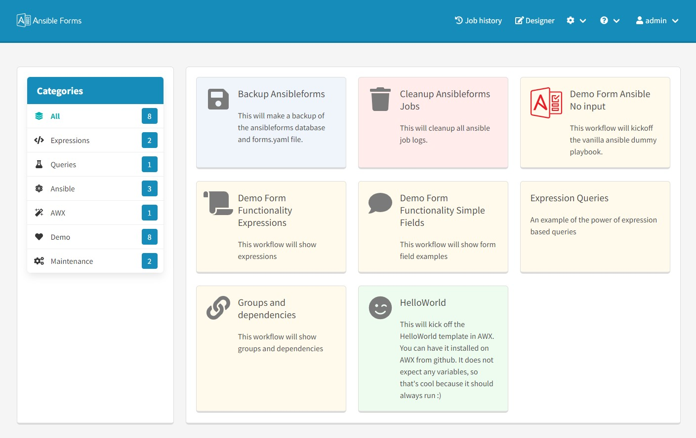

[More screenshots](https://github.com/ansibleguy76/ansibleforms/wiki/GUI)
# Intro
Ansible forms is a lightweight node.js webapplication to generate userfriendly and pretty forms to kickoff ansible playbooks or awx (ansible tower) templates.

# Configuration / documentation
[Go to the documentation wiki](https://github.com/ansibleguy76/ansibleforms/wiki "Wiki")

# Requirements
- node.js capable server or container
- MySql/MariaDb server to cover local authentication (can be containerized)

# Capabilities
- Categorize forms
- Role based access
- Cascaded dropdowns (sql / rest / javascript)
- Expressions (javascript)
- Field dependencies
- Add icons
- Field validations
- Group fields
- Nested output modelling (control the form output in a multilevel object)
- Json web tokens authorization (jwt) (access & refresh)
- Environment variables
- Ldap & local authentication

# How to install and run in docker
## Use docker compose (recommended)

Follow this procedure (https://github.com/ansibleguy76/ansibleforms-docker)

## Install docker image manually
Installing it manually requires more linux and sysadmin skills.
### Install MySql (or skip to use exising one)
The application needs a MySQL (or MariaDb) server.  You can have your own pick, run in docker, run remote, run locally.  Just make sure it is accessible and set the environment variables in the application to connect to it.  
The code below is to install natively in centos7, lookup the procedure for your own linux flavour.
```
wget https://dev.mysql.com/get/mysql57-community-release-el7-9.noarch.rpm
sudo rpm -ivh mysql57-community-release-el7-9.noarch.rpm
sudo yum install mysql-server
sudo systemctl start mysqld
sudo grep 'temporary password' /var/log/mysqld.log
sudo mysql_secure_installation
* the above will be interactive
* do NOT disallow remote access
* set new password of choice
```
Note : The first time, the webapplication will ask to create the database and tables. So you might want to give enough privileges.

### Get image from docker hub
If you don't want to go through the hassle of a dockerbuild.  Run a docker image directly from docker hub.

If you want, you can use the latest build from docker hub (https://hub.docker.com/repository/docker/ansibleguy/ansibleforms)
Note that we have deployed the solution in the `/app` folder inside the docker.  So if you want your `forms.yaml`, logs, certificates and playbooks reachable from within the docker image, you have to use a mount path or persistent volume and make sure it's mounted under `/app/dist/persistent`.  
Make sure you have your environment variables set.  Most variables fall back to defaults, but the MySQL database connection is mandatory.  The image contains ansible and python3.  The below command is merely an example. An example of a forms.yaml you can find here (https://github.com/ansibleguy76/ansibleforms/tree/main/server/persistent).
```
docker run -p 8000:8000 -d -t --mount type=bind,source=/srv/apps/ansibleforms/server/persistent,target=/app/dist/persistent --name ansibleforms -e DB_HOST=192.168.0.1 -e DB_USER=root -e DB_PASSWORD=password ansibleguy/ansibleforms
```
Once started :
```
docker ps
CONTAINER ID   IMAGE                     COMMAND                  CREATED         STATUS         PORTS                                       NAMES
d91f7b05b67e   ansibleguy/ansibleforms   "node ./dist/index.js"   7 seconds ago   Up 6 seconds   0.0.0.0:8000->8000/tcp, :::8000->8000/tcp   ansibleforms
```
# How to run a custom build
If you are familiar with Node js, you can download the code and build and run this locally, using PM2 for example.
This project has 2 node applications
- A client app in vue
- A server app in express

The client app will dynamically build the forms (vue.js v2) for ansible/awx, based on a single yaml file (forms.yaml).
The server app (express.js) will cover authentication, background database connections and executing the ansible playbooks or awx templates.
## Project download
```
# remove nodejs if needed
yum remove -y nodejs
# get repro
yum install -y gcc-c++ make
curl -sL https://rpm.nodesource.com/setup_14.x | sudo -E bash -

# install nodejs
yum install -y nodejs

# create holder folder (can be custom)
mkdir /srv/apps
cd /srv/apps

# grab the code from github
yum install -y git
‌‌git init
git clone https://github.com/ansibleguy76/ansibleforms.git

# enter the app project
cd ansibleforms

# verify that you have 2 subfolder
```
## Project init
First we install all nodejs dependencies for both client & server
```
cd server
npm install

cd ..
cd client
npm install

cd ..
```
Second we prep our environment variables.  An environment variable file contains the configuration of this application, such as http(s) settings, ldap settings, database connections, log settings, ...
This application comes with an `.env.example` file that you must copy to `.env.development` or `.env.production` and adjust to your needs.  You can maintain both development and production file to test if you have different dev & prod environments and settings.
```
cd client
cp .env.example .env.development

cd ..
cd server
cp .env.example .env.development
cp ./persistent/forms.yaml.example ./persistent/forms.yaml
```
## Modify the .env.development (or .env.production) to your needs
- enable https if needed and set the certificates (the code comes with self signed certficates)
- update forms path and log path
- set mysql server connection details
## Modify the forms.yaml to your needs
The `forms.yaml` file describes all your forms in a yaml format.  It must be available in the server application.  By default the webapp will search under `/server/persistent` In the file, make the proper changes, check the wiki documentation for all details.

- add categories
- add roles
- add forms

# How to run
## In development
First of all one must understand that this application has both a client and server side.
The client side is build with vue2 and compiles in a single html, css & js script file.
The server side is build with express (must also be compiled) and runs the api's and database connections.

All behavior and how things are started using the `npm run command` is in the `package.json` file (one for client and one for server).  There are several methods like 'build, bundle, start, ...' depending on what you want to do.
### Run both server and client for development
When you test a vue2 application (client application), it typically spins up a temporary Express webserver, which is useless if you also have a server application, which would not but running in this case.  Therefor we have added a `vue.config.js` file which also starts our server code in that temp express server.  Now we start our client app in development, along with the server code.  We also use nodemon to auto rebuild if the code changes.
```
cd client
npm run start
```
### Run compiled in development
If are done testing, you can compile the client code and have it embedded into the server code.  And then spin up the server application.  the command `npm run bundle` will compile the client code and copy it under `/views` in the server application.  You can then start the server application with `npm run dev`, and as you will see in the `package.json`, it will build, copy the environment file and start the server application in dev mode.

First we compile the client code, and bundle it in the server code
```
cd client
npm run bundle
```
Then we run the server code in development mode.  `npm run dev` will also copy the `.env.development` file into the `./dist` folder, so make sure it's there !
```
cd ..
cd server
npm run dev
```
## Run in production
### Run with PM2
Running the application in the commandline, makes it fragile when something goes wrong.  We need an environment where the nodejs application can run when logged of, where it can be monitored and even restarted in case of a crash.  That's were PM2 comes in. (https://pm2.keymetrics.io/)
```
npm install -g pm2
```
We again compile the client code and bundle it in the server code
```
cd client
npm run bundle
```
We now compile the server code, but don't start it.
```
cd ..
cd server
npm run build
```
Then we copy a production ready environment file. (change it to fit your production environment)
```
cp .env.example ./dist/.env.production
```
Then we start it in PM2.  
```
cd dist
pm2 start ecosystem.config.js --env production
```
Once started
```
# pm2 status
┌─────┬─────────────────┬─────────────┬─────────┬─────────┬──────────┬────────┬──────┬───────────┬──────────┬──────────┬──────────┬──────────┐
│ id  │ name            │ namespace   │ version │ mode    │ pid      │ uptime │ ↺    │ status    │ cpu      │ mem      │ user     │ watching │
├─────┼─────────────────┼─────────────┼─────────┼─────────┼──────────┼────────┼──────┼───────────┼──────────┼──────────┼──────────┼──────────┤
│ 0   │ ansibleforms    │ default     │ 1.0.0   │ fork    │ 3104     │ 8s     │ 0    │ online    │ 0%       │ 57.1mb   │ root     │ enabled  │
└─────┴─────────────────┴─────────────┴─────────┴─────────┴──────────┴────────┴──────┴───────────┴──────────┴──────────┴──────────┴──────────┘
```
# First time run
## Create AnsibleForms database
The first time you surf to the webapplication, it will ask you if it should create the AnsibleForms schema.  
## Admin user
The default admin user is :
- username : admin
- password : AnsibleForms!123

# Technologies
The webapplication is based on a
- Frontend
  - vue 2
  - bulma.io (responsive css framework)
  - FontAwesome (icon font library)
- Backend
  - express (nodejs)
- Database
  - MySql/MariaDb
